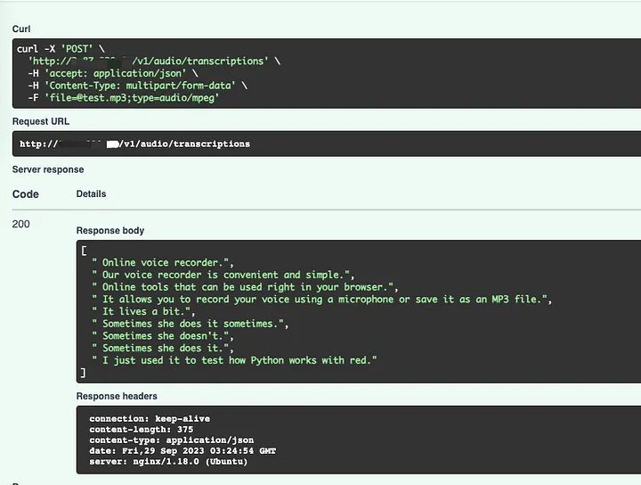

# Hosting OpenAI Whisper

This repository contains nodes and code to host OpenAI Whisper models on different platforms. 

It has been heavily inspired and has used the following resources: 
* [Hosting OpenAI Whisper on AWS](https://medium.com/@hyiqiu23/hosting-a-openai-whisper-on-aws-for-free-db0bc85481f6) by [Yichewy](https://medium.com/@hyiqiu23)
* [Whisper C++0 Project](https://github.com/ggml-org/whisper.cpp)

## Basics: Hosting Whisper on EC2
This is basically following this Medium article: [Hosting OpenAI Whisper on AWS](https://medium.com/@hyiqiu23/hosting-a-openai-whisper-on-aws-for-free-db0bc85481f6).

The steps are: 
- Create a VM (Ubuntu). Make sure you can SSH and that it has a public IP. Install python. 
- Clone https://github.com/hyqshr/whispercpp-fastapi.git
- Pip install `python3-pip` and `ffmpeg`
- Pip install -r requirements.txt
- Install and configure nginx. Run nginx. 

```
server {
    listen 80;
    server_name 3.87.220.60;
    location / {
        proxy_pass http://127.0.0.1:8000;
    }
}
```

You can then expldore the API at `http://<your-ec2-public-ip>/docs`. <br>
You can test the transcription endpoint with the following (check the endpoint, so it fits with the one you have): <br>


## A bit better: Running as a service
To make sure the service is always running, you can create a systemd service. 

Create a file `/etc/systemd/system/whisper.service` with the following content (make sure you replace the paths and user accordingly): 

```
[Unit]
Description=FastAPI Whisper service
After=network.target

[Service]
User=ubuntu
Group=ubuntu
WorkingDirectory=/home/ubuntu/whispercpp-fastapi
ExecStart=python3 -m uvicorn main:app --host 0.0.0.0 --port 8000

Restart=always
PrivateTmp=false
ReadWritePaths=/tmp

[Install]
WantedBy=multi-user.target
                                    
```
Make sure that: 
* You replace `User` and `Group` with the user you want to run the service as.
* You replace `WorkingDirectory` with the path to your cloned repository. 

Then run: 
```
sudo systemctl daemon-reload
sudo systemctl start whisper.service
sudo systemctl enable whisper.service
```